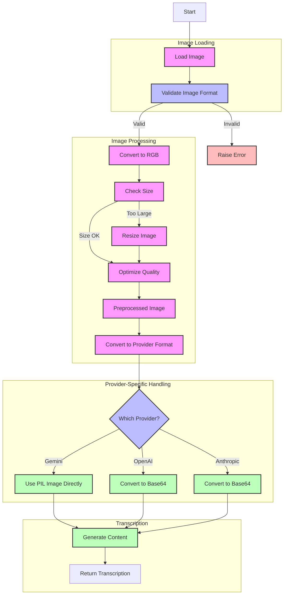

# Image Processing Flow for Stage 1

> **Flowchart Color Guide**:
> - 🟪 Pink boxes: File operations (loading, processing, conversion)
> - 🟦 Blue boxes: Decision points (format validation, provider selection)
> - 🟩 Green boxes: Actions (API calls, content generation)
> - 🟥 Red boxes: Error conditions and handling

## Flow Description

1. **Image Loading**
   - Image is loaded using PIL.Image.open
   - Format validation checks for supported image types

2. **Image Processing**
   - Convert image to RGB format for consistency
   - Check image dimensions against size limits
   - Resize if image exceeds maximum dimensions
   - Optimize quality while maintaining size limits
   - Prepare for provider-specific format conversion

3. **Provider-Specific Handling**
   - Gemini: Uses PIL Image object directly
   - OpenAI: Converts to base64 with data URL
   - Anthropic: Converts to base64 with specific format

4. **Transcription**
   - Image is sent to provider with prompt
   - Transcription is returned as text

## Key Components

- `image_utils.py`: Handles image loading, validation, and conversion
- `model_factory.py`: Manages provider-specific implementations
- `model_manager.py`: Orchestrates the transcription process

## File Operations

1. `load_image()`: Loads image file and performs initial validation
2. `preprocess_image()`:
   - Converts to RGB format
   - Checks image dimensions
   - Resizes if necessary
   - Optimizes quality
3. `convert_to_base64()`: Converts processed image to base64 for OpenAI/Anthropic
4. `generate_content()`:
   - Formats image for specific provider
   - Sends to API with prompt
   - Handles retries if needed
   - Returns transcription text

## Error Handling

1. **Image Loading Errors**
   - Unsupported file formats
   - File not found or inaccessible
   - Corrupt image data

2. **Processing Errors**
   - Invalid color mode
   - Dimension validation failures
   - Memory constraints during resize
   - Quality optimization issues

3. **Provider-Specific Errors**
   - Base64 conversion failures
   - API connection timeouts
   - Rate limiting responses
   - Authentication failures

4. **Recovery Mechanisms**
   - Automatic retry with exponential backoff
   - Detailed error reporting
   - Graceful failure handling
   - Clear error messages for debugging
