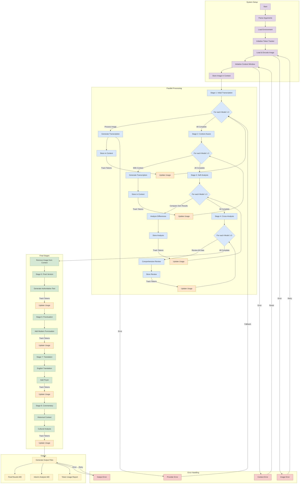

# Chinese Family Tree Processing System Flow

> **Flowchart Color Guide**:
> - 🟪 Pink boxes: File/Data operations
> - 🟦 Blue boxes: Decision points
> - 🟩 Green boxes: Processing stages
> - 🟥 Red boxes: Error handling

## Program Flow Description

1. **Initial Processing**
   - Load and validate input image
   - Initialize LLM providers (Gemini, OpenAI, Anthropic)
   - Convert image to standardized Base64 format

2. **Multi-LLM Stages (1-4)**
   - Parallel Processing
     * Each stage runs LLMs concurrently
     * Results synchronized after each stage
     * All LLMs must complete before next stage

   - Stage 1: Initial Transcription
     * Each LLM independently transcribes the image
     * No semantic context considered
     * Results stored for comparison
   
   - Stage 2: Context-Aware Transcription
     * Each LLM performs second transcription
     * Considers semantic and historical context
     * Results stored alongside Stage 1
   
   - Stage 3: Self-Analysis
     * Each LLM compares their Stage 1 & 2 results
     * Analyzes differences and patterns
     * Makes character-specific recommendations
   
   - Stage 4: Comprehensive Review
     * Each LLM reviews all transcriptions
     * Analyzes all recommendations
     * Provides final character suggestions

3. **Final Processing (Stages 5-8)**
   - Stage 5: Authoritative Transcription
     * LLM4 reviews all Stage 4 analyses
     * Resolves any conflicts
     * Produces definitive transcription
   
   - Stage 6: Punctuation
     * LLM4 adds modern Chinese punctuation
     * Maintains authenticity
     * Enhances readability
   
   - Stage 7: Translation
     * LLM4 translates to English
     * Adds Pinyin for names
     * Preserves relationships
   
   - Stage 8: Historical Context
     * LLM4 provides academic commentary
     * Explains cultural significance
     * Converts dates to Gregorian calendar

4. **Error Handling & Recovery**
   - Error Types
     * Image processing errors (format, size, corruption)
     * Model initialization errors (API keys, configuration)
     * Provider-specific errors (rate limits, timeouts)
     * Network connection issues

   - Recovery Mechanisms
     * Automatic retries with exponential backoff
     * Provider failover options
     * Partial results preservation
     * Session recovery capability

   - Error Reporting
     * Detailed error messages
     * Stage-specific error context
     * Processing history logs
     * Token usage at failure

## Key Components

1. **Model Management**
   - `model_manager.py`: Orchestrates LLM interactions
   - `model_factory.py`: Creates provider instances
   - `model_interfaces.py`: Defines provider interfaces

2. **Image Processing**
   - `image_utils.py`: Handles image operations
   - Consistent Base64 conversion for all providers
   - Size and quality optimization
   - Standard format across LLMs

3. **Stage Processing**
   - `stage_prompts.py`: Defines stage-specific prompts
   - Stage-specific error handling
   - Result storage and management

4. **Configuration**
   - `config.py`: System configuration
   - Environment variables management
   - Provider-specific settings

5. **Token Management**
   - `token_costs.py`: Defines cost rates
   - Real-time token tracking
   - Usage reporting
   - Cost calculation

6. **Output Management**
   - Stores transcriptions by stage
   - Tracks token usage
   - Generates usage reports
   - Maintains processing history
