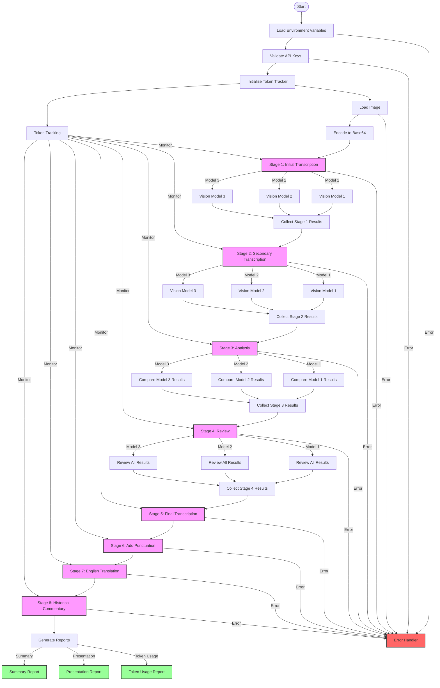

# Chinese Family Tree Processing System Flow

```mermaid
graph TD
    %% Input and Initial Setup
    Start([Start]) --> LoadEnv[Load Environment Variables]
    LoadEnv --> ValidateKeys[Validate API Keys]
    ValidateKeys --> InitTokenTracker[Initialize Token Tracker]
    InitTokenTracker --> LoadImage[Load Image]
    LoadImage --> EncodeImage[Encode to Base64]

    %% Stage 1: Initial Transcription
    EncodeImage --> Stage1[Stage 1: Initial Transcription]
    Stage1 --> |Model 1| S1M1[Vision Model 1]
    Stage1 --> |Model 2| S1M2[Vision Model 2]
    Stage1 --> |Model 3| S1M3[Vision Model 3]
    S1M1 --> Stage1Results[Collect Stage 1 Results]
    S1M2 --> Stage1Results
    S1M3 --> Stage1Results

    %% Stage 2: Secondary Transcription
    Stage1Results --> Stage2[Stage 2: Secondary Transcription]
    Stage2 --> |Model 1| S2M1[Vision Model 1]
    Stage2 --> |Model 2| S2M2[Vision Model 2]
    Stage2 --> |Model 3| S2M3[Vision Model 3]
    S2M1 --> Stage2Results[Collect Stage 2 Results]
    S2M2 --> Stage2Results
    S2M3 --> Stage2Results

    %% Stage 3: Analysis
    Stage2Results --> Stage3[Stage 3: Analysis]
    Stage3 --> |Model 1| S3M1[Compare Model 1 Results]
    Stage3 --> |Model 2| S3M2[Compare Model 2 Results]
    Stage3 --> |Model 3| S3M3[Compare Model 3 Results]
    S3M1 --> Stage3Results[Collect Stage 3 Results]
    S3M2 --> Stage3Results
    S3M3 --> Stage3Results

    %% Stage 4: Review
    Stage3Results --> Stage4[Stage 4: Review]
    Stage4 --> |Model 1| S4M1[Review All Results]
    Stage4 --> |Model 2| S4M2[Review All Results]
    Stage4 --> |Model 3| S4M3[Review All Results]
    S4M1 --> Stage4Results[Collect Stage 4 Results]
    S4M2 --> Stage4Results
    S4M3 --> Stage4Results

    %% Stage 5-8: Final Processing
    Stage4Results --> Stage5[Stage 5: Final Transcription]
    Stage5 --> Stage6[Stage 6: Add Punctuation]
    Stage6 --> Stage7[Stage 7: English Translation]
    Stage7 --> Stage8[Stage 8: Historical Commentary]

    %% Output Generation
    Stage8 --> GenerateReport[Generate Reports]
    GenerateReport --> |Summary| SummaryReport[Summary Report]
    GenerateReport --> |Presentation| PresentationReport[Presentation Report]
    GenerateReport --> |Token Usage| TokenReport[Token Usage Report]

    %% Error Handling
    LoadEnv --> |Error| ErrorHandler[Error Handler]
    ValidateKeys --> |Error| ErrorHandler
    LoadImage --> |Error| ErrorHandler
    Stage1 --> |Error| ErrorHandler
    Stage2 --> |Error| ErrorHandler
    Stage3 --> |Error| ErrorHandler
    Stage4 --> |Error| ErrorHandler
    Stage5 --> |Error| ErrorHandler
    Stage6 --> |Error| ErrorHandler
    Stage7 --> |Error| ErrorHandler
    Stage8 --> |Error| ErrorHandler

    %% Token Tracking
    InitTokenTracker --> TokenTracking[Token Tracking]
    TokenTracking --> |Monitor| Stage1
    TokenTracking --> |Monitor| Stage2
    TokenTracking --> |Monitor| Stage3
    TokenTracking --> |Monitor| Stage4
    TokenTracking --> |Monitor| Stage5
    TokenTracking --> |Monitor| Stage6
    TokenTracking --> |Monitor| Stage7
    TokenTracking --> |Monitor| Stage8

    %% Styling
    classDef process fill:#f9f,stroke:#333,stroke-width:2px;
    classDef error fill:#f66,stroke:#333,stroke-width:2px;
    classDef report fill:#9f9,stroke:#333,stroke-width:2px;
    class ErrorHandler error;
    class SummaryReport,PresentationReport,TokenReport report;
    class Stage1,Stage2,Stage3,Stage4,Stage5,Stage6,Stage7,Stage8 process;
```
